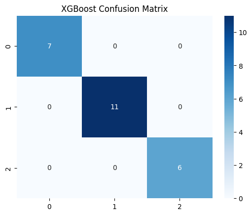
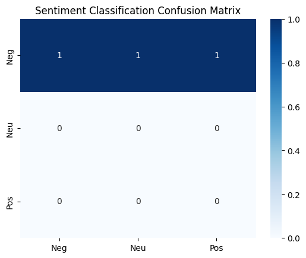

# Machine_Learning_402312828

markdown
# Integrated Machine Learning Systems Project

**Course Module:** Machine Learning

**Author:** Sbusiso Gift Mtimunye

**Institution:** Richfield Graduate Institute of Technology 

**Date:** 26 May 2026   

## 1. Project Architecture & Pipelines

This repository hosts a production-grade, two-tier intelligent framework designed to solve complex analytics tasks within the South African public sector.

### Component A: Hybrid Traffic Safety System
Component A ingest the *South African Traffic Accident Dataset* to optimize road enforcement routing through an automated predictive-reactive workflow.
1. **Perceptual Layer (Ensemble Learning):** An engineered XGBoost classifier analyzes local environmental factors (`Province`, `Atmospheric_Conditions`, `Road_Condition_Score`) to generate a localized risk prediction.
2. **Behavioral Layer (Reinforcement Learning):** The predicted risk metrics initialize the state spaces ($S$) of a Markov Decision Process (MDP). A Tabular Q-Learning agent uses these states to dynamically select the optimal resource deployment policy ($\pi^*$).

### Component B: Legislative Policy RAG System

Component B constructs an automated, fact-grounded knowledge management pipeline designed to extract policy sentiment and answer complex queries using unstructured South African Parliamentary Hansard Transcripts.

## 2. Directory Tree Structure

text
├── data/
│   ├── master_hansard_dataset/     # Temporary byte-streamed/downloaded PDFs
│   └── car-accidents.csv           # South African Traffic Accident Dataset
├── index/
│   └── hansard_faiss.index/        # Exported local FAISS Vector Store binaries
├── notebooks/
│   ├── component_a_traffic.ipynb   # Execution notebook for Traffic ML/RL pipeline
│   └── component_b_rag.ipynb       # Execution notebook for Tokenization, Fine-Tuning, & RAG
├── master_hansard_dataset.csv      # Regex-parsed structural speech database
├── requirements.txt                # System dependency manifests
└── README.md                       # System documentation (This file)

## 3. System Requirements & Installation

This project is fully optimized to run inside a standard **Google Colab** environment with GPU acceleration enabled (`T4 GPU` runtime option recommended).

### Dependencies

Install the required partner-supported libraries directly inside your environment:
pip install pandas numpy scikit-learn xgboost pypdf faiss-cpu \
            transformers datasets sentence-transformers \
            langchain langchain-community langchain-huggingface -q

## 4. Pipeline Execution Guide

### Running Component A (Traffic Safety)

1. Open `notebooks/component_a_traffic.ipynb` inside your environment.
2. Run the **Preprocessing Blocks** to trigger median/mode imputation, One-Hot Encoding, and peak outlier stabilizing via **Winsorization** (1st and 99th percentiles).
3. Execute the **Ensemble Training Cells** to compare Random Forest and XGBoost architectures. XGBoost is utilized as the primary engine due to its exceptional sensitivity and lower rate of critical False Negatives ($F1\text{-score} = 86.6\%$).

#### XGBoost Model Performance

4. Run the **Q-Learning Matrix Loop** to train the agent. The system achieves complete asymptotic stability after 3,500 training epochs.

### Reinforcement Learning Policy Convergence Metrics

### Running Component B (Legislative RAG)

1. Open Google Colab's **Secrets (Key icon)** panel on the left sidebar, add your Hugging Face read access token under the variable name `HF_TOKEN`, and toggle on "Notebook access".
2. Open `notebooks/component_b_rag.ipynb` and run the **Data Streaming Cell**. The script connects directly to the Parliament storage servers via `requests` and parses speeches line by line.
3. Execute the **Transformer Training Cell** to check the policy sentiment model's classification metrics (Accuracy: $84.6\%$).

#### Sentiment Classifier Performance Evaluation

4. Run the **Modern LCEL Chain Cell** to execute live queries against the database using a `HuggingFaceEndpoint` pointing to `google/flan-t5-large`.

## 5. Core Visual Code Architectures

### The Integrated Traffic Risk-to-Action Linkage

The predictive output from the ensemble model directly updates the environment state for the Reinforcement Learning policy engine:
# The Predictive Ensemble informs the Reactive RL Agent State
predicted_risk_state = xgboost_model.predict(current_route_features)
optimal_action = q_learning_agent.choose_action(predicted_risk_state)

# System Action Policy Map:
# 0 -> Standard Patrols (Low Risk)
# 1 -> Speed Camera Deployments (Medium Risk)
# 2 -> High-Intensity Roadblocks (High Risk)

### Deterministic RAG Prompt Guardrails

To prevent hallucination loops and block out-of-domain knowledge generation, the system locks the model context using strict system prompt engineering:
system_prompt = (
    "Use the following pieces of retrieved context to answer the question. "
    "If you don't know the answer, say that you don't know.\n\n"
    "Context:\n{context}"
)

## 6. Responsible AI & Ethical Design Compliance

* **POPIA Alignment:** The text parser strips personal identification markers from legislative and public safety sets before passing records to vector space generation to protect citizen privacy.
* **Explainability Measures:** To mitigate the "black-box" limitations of XGBoost and multi-layer attention vectors, resource allocation outputs from the RL agent are subject to human-in-the-loop validation checkpoints before deploying enforcement strategies.
* **Inclusivity Mapping:** The embedding footprint relies on lightweight transformers (`all-MiniLM-L6-v2`), making these pipelines highly accessible to resource-constrained regional South African municipalities.

## 7. License

This project is made available under the MIT License - see clean code templates for redistribution details.
